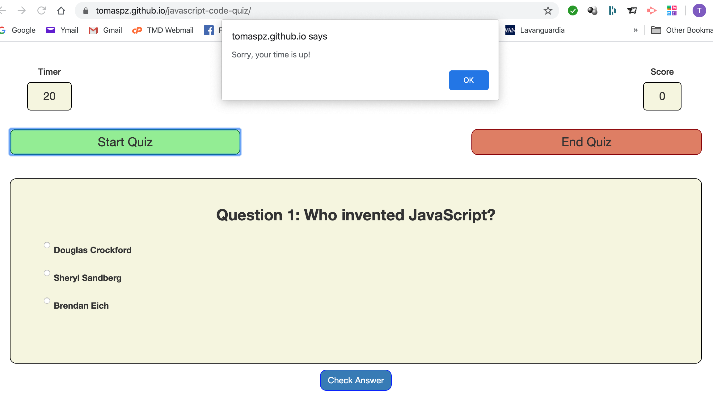

# javascript-code-quiz

This code quiz project is a complete a coding assessment made with Web APIs.
The quiz is a combination of multiple-choice questions and interactive challenges. 
A timer is build to get a timed code quiz with multiple-choice questions. 
This app runs in the browser.
This app features dynamically updated HTML and CSS powered by JavaScript code. 
This app also features a clean and polished user interface.
This app is responsive by using Bootstrap to make sure it adapts to multiple screen sizes.
The timed quiz is about JavaScript fundamentals knowledge.
It stores high scores to gauge the student progress along the test.

## How it works:

1.- When the user clicks the start button, a timer starts and the user is presented with a question.

2.- After the user answers a question, another question is presented.

3.- When the user answers a question incorrectly, the score does not increase. Time is subtracted from the clock

4.- When all questions are answered or the timer reaches 0, the game is over.

5.- When the game is over, save the user initials and the score.

## Application screenshot:

## Link to the functional, deployed application.

https://tomaspz.github.io/javascript-code-quiz/

## Link to the GitHub repository. 

https://github.com/tomaspz/javascript-code-quiz

